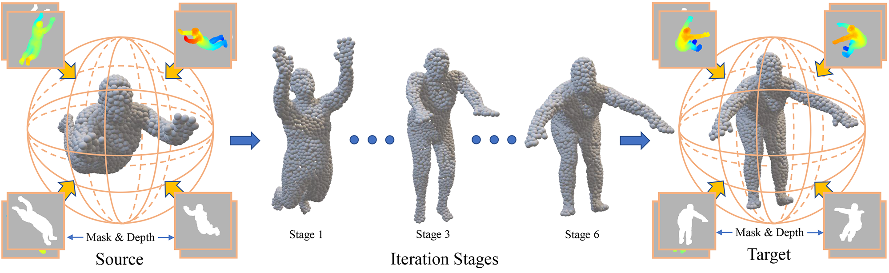

# RMA-Net

This repo is the implementation of the paper: Recurrent Multi-view Alignment Network for Unsupervised Surface Registration (CVPR 2021). Some files and source code are not uploaded yet, but they will be released very soon.

Paper address: [https://arxiv.org/abs/2011.12104](https://arxiv.org/abs/2011.12104)

Project webpage: [https://wanquanf.github.io/RMA-Net.html](https://wanquanf.github.io/RMA-Net.html)

## Prerequisite Installation
The code has been tested with Python3.8, PyTorch 1.6 and Cuda 10.2:

    conda create --name rmanet
    conda activate rmanet
    conda install pytorch=1.6.0 torchvision=0.7.0 cudatoolkit=10.2 -c pytorch
    conda install -c conda-forge igl

## Usage

### Pre-trained Models
Download the [pre-trained models](https://none) and put them in the *[YourProjectPath]/pre_trained* folder. 

### Run the registration
To run registration for a single sample, you can run:

    code for registration a single sample

The results are listed in the folder named *XXX_results*, including the deforming results of different stages. We have given a collection of samples in *[YourProjectPath]/samples*, and you can run the registration for them by:
    
    code for registration a collection of samples

### Datasets
To show how to construct a dataset that can be used in the code, we list some toy pairs
in the *[YourProjectPath]/toy_dataset* folder and give a script to pack them into a bin file:

    code for constructing a dataset

Or you can also download the dataset we used in the paper [here](https://none).

### Train & Test
To test on the whole testing set, run:

    code for testing on the whole dataset

To train the network, run:

    code for training the network

## Citation
Please cite this paper with the following bibtex:

    @inproceedings{feng2021recurrent,
        author    = {Wanquan Feng and Juyong Zhang and Hongrui Cai and Haofei Xu and Junhui Hou and Hujun Bao},
        title     = {Recurrent Multi-view Alignment Network for Unsupervised Surface Registration},
        booktitle = {{IEEE/CVF} Conference on Computer Vision and Pattern Recognition (CVPR)},
        year      = {2021}
    }

